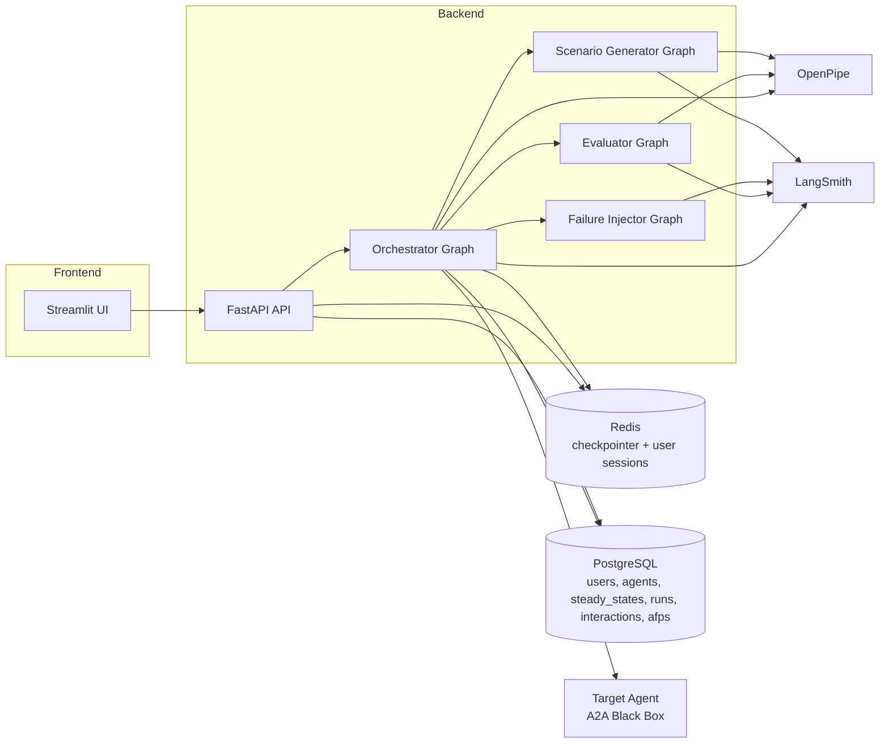
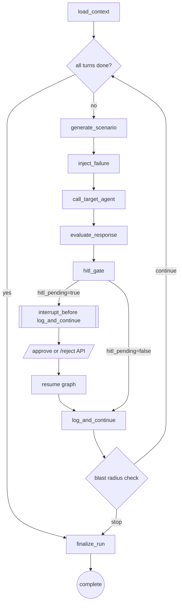
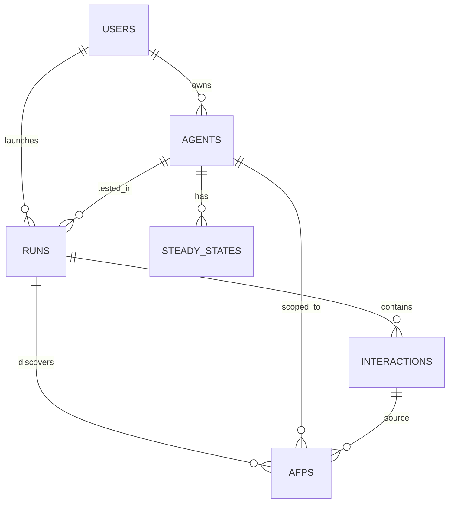

## ChaosAgent

ChaosAgent is a production-focused Agentic Chaos Engineering (ACE) platform for black-box testing AI agents over A2A. It runs hypothesis-driven turbulence experiments, measures resilience with SRQ/HRT, supports HITL pause/resume, and captures long-term failure memory for continuous improvement via OpenPipe.

## Prerequisites

- Python 3.11+
- Docker + Docker Compose
- PostgreSQL 15 (via compose)
- Redis 7 (via compose)
- Google OAuth credentials
- OpenAI, OpenPipe, and LangSmith API keys

## Local Setup

1. Create and activate virtualenv:
   - `py -3 -m venv .venv`
   - `.\.venv\Scripts\Activate.ps1`
2. Install dependencies:
   - `python -m pip install -r requirements.txt -r requirements-dev.txt`
3. Configure env:
   - `Copy-Item .env.example .env`
   - Fill all required values.
4. Start infra:
   - `docker-compose up -d`
5. Run migrations:
   - `.\.venv\Scripts\python.exe -m alembic upgrade head`
6. Start backend:
   - `.\.venv\Scripts\python.exe -m uvicorn backend.main:app --reload --port 8000`
7. Start frontend:
   - `.\.venv\Scripts\python.exe -m streamlit run streamlit_app/app.py --server.port 8501`

## Run Tests

- `.\.venv\Scripts\python.exe -m pytest -q`

## Connect a Real Agent and Run First Experiment

1. Open Streamlit at `http://localhost:8501`.
2. Login with Google OAuth.
3. Go to **1_connect_agent**, upload Agent Card JSON/YAML or paste endpoint URL.
4. Go to **2_steady_state** and run baseline.
5. Go to **3_run_chaos**, select monkeys/intensity/blast radius, then launch.
6. Monitor SSE stream; approve/reject HITL events as needed.

## Troubleshooting

- `alembic upgrade` fails with connection refused:
  - Verify `docker-compose ps`, then check `DATABASE_URL` and Postgres health.
- Backend startup fails on checkpointer:
  - Redis unavailable and `USE_MEMORY_SAVER=false`; start Redis or set dev flag true locally.
- OAuth redirect loop:
  - Ensure `GOOGLE_REDIRECT_URI` matches Google console and `.env`.
- Streamlit shows unauthorized:
  - Verify JWT is present in query/session and `DEV_BYPASS_AUTH` as expected.
- SSE disconnects:
  - Confirm reverse proxy timeout settings and heartbeat events every 15s.

## Architecture Diagram

## OrchestratorState Execution Flow

## Database ER Diagram

